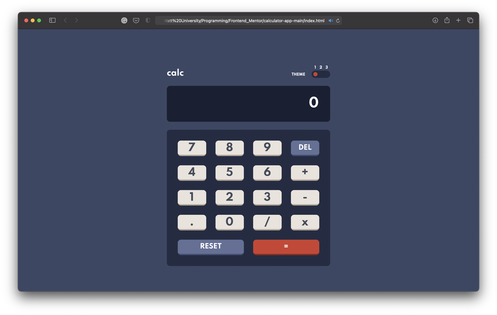

# Frontend Mentor - Calculator app solution

This is a fully functioning calculator app inspired by the [Calculator app challenge on Frontend Mentor](https://www.frontendmentor.io/challenges/calculator-app-9lteq5N29).

## Table of contents

- [Overview](#overview)
  - [The challenge](#the-challenge)
  - [Screenshot](#screenshot)
  - [Links](#links)
- [My process](#my-process)
  - [Built with](#built-with)
  - [What I learned](#what-i-learned)
  - [Useful resources](#useful-resources)


## Overview

### The challenge

Users should be able to:

- See the size of the elements adjust based on their device's screen size
- Perform mathmatical operations like addition, subtraction, multiplication, and division
- Adjust the color theme based on their preference

For detailed design guidelines see the [style guide](design/style-guide.md). 


### Screenshot

#### Desktop design 


#### Mobile design
Default/ Light/ Dark theme


### Links

- Solution URL: [linarietuma.github.io/calculator-app/](https://linarietuma.github.io/calculator-app/)

## My process

### Built with

- Semantic HTML5 markup
- CSS custom properties
- CSS Grid
- Javascript


### What I learned

The aim of this project was to reinforce lessons learnt on the first half of the [Web Development Bootcamp 2021](https://www.udemy.com/share/101W9C2@FG1KfUtgc1EKcUBFCnFzfj5u/). Some of the major learnings while working through this project include:   

Arrow functions:
```js
const add = (a, b) => a + b;
```

Event Listeners: 
```js
// assign click event listener to each button 
for (let i = 0; i < btn.length; i++) {
    btn[i].addEventListener('click', () => {
        displayed.innerHTML = clicked(btn[i].value); // upon clicking clicked() is executed parsing in the button's corresponding value
    });
}
```
```js
// add keydown event listener 
document.addEventListener('keydown', e => {
    try {
        // 
        displayed.innerHTML = clicked(keyboard[e.key]);
    }
    catch {
        console.log('Invalid key');
    }
});
```

Array methods:
```js
total = [...result.toString()]; 
return argument1.reduce((total, num) => total + num);
```


### Useful resources

- [Tristate Toggle Switch](https://dev.to/sanaz/tristate-toggle-switch-509n)- useful step-by-step explanation on how to style radio buttons into a tridtate toggle switch


